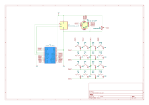

# Macropad4x4

4×4 macropad with a use of Arduino Pro Micro, SSD1306 OLED, potenciometer and a rotary switch.

## Hardware
- MCU: Arduino Pro Micro (ATmega32U4)
- Display: SSD1306 128×32 I2C
- Diod: 1N4148
- Potenciometer: 10k/N
- Rotary switch: RTS-01-112-42RP

## Schematic


## Firmware
QMK

### Build
```bash
cd firmware
qmk compile -kb macropad4x4 -km default
qmk flash -kb macropad4x4 -km default
```

## License
- Firmware: [GPL v2](LICENSE)
- Hardware: [CERN OHL-S v2](LICENSE.hardware)
